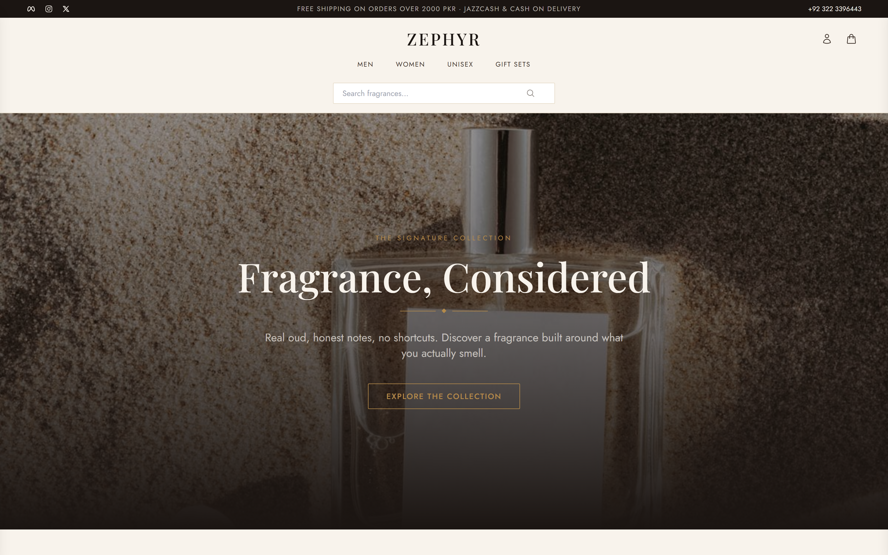

# Zephyr

> A modern MERN perfume & fragrance e-commerce store — browse, shop, and check out with JazzCash or Cash on Delivery.


Zephyr is a full-stack perfume and fragrance storefront built on the MERN stack. Shoppers can explore gender-based collections, filter and sort a product catalog, manage a persistent cart, and complete orders through JazzCash hosted checkout or Cash on Delivery. It ships with a complete admin dashboard for managing products, orders, and users, plus email-OTP authentication and Cloudinary-backed image uploads.

<p align="center">
  
</p>

## ✨ Features

- 🛍️ **Product catalog** with gender-based collections, filtering, sorting, and search
- 🔎 **Product detail pages** with rich imagery and add-to-cart flow
- 🛒 **Persistent cart** with a slide-out cart drawer and guest/authenticated merge
- 💳 **Checkout with two payment methods** — JazzCash hosted checkout (signed secure-hash flow) and Cash on Delivery
- 🔐 **Email-OTP authentication** — register, verify, login, and password reset via Nodemailer
- 👤 **User accounts** with profile management and order history ("My Orders")
- 📦 **Order tracking** — confirmation, order detail, and status pages
- 🛠️ **Admin dashboard** — manage products (create/edit/delete), orders, and users
- ☁️ **Cloudinary image uploads** via Multer for product media
- 🚦 **Rate limiting** on sensitive endpoints and JWT-protected routes
- 📰 **Newsletter subscribers** endpoint
- 🔔 **Toast notifications** with Sonner and React-Toastify

## 🛠️ Tech Stack

**Frontend:** React 18, Vite 6, Redux Toolkit, React-Redux, React Router 7, Tailwind CSS 3, Axios, React Icons, Sonner, React-Toastify

**Backend:** Node.js, Express 4, MongoDB with Mongoose, JSON Web Tokens, bcryptjs, Multer, Cloudinary, Nodemailer, express-rate-limit, streamifier

**Payments:** JazzCash (hosted checkout with secure-hash signing) + Cash on Delivery

## 🚀 Getting Started

### Prerequisites

- Node.js 18+ and npm
- A MongoDB database (local or Atlas)
- A Cloudinary account (for product image uploads)
- An SMTP email account (for OTP emails)
- JazzCash merchant credentials (optional — the option auto-hides if not configured)

### Installation

```bash
# Clone the repository
git clone <your-repo-url>
cd Zephyr

# Install backend dependencies
cd backend
npm install

# Install frontend dependencies
cd ../frontend
npm install
```

### Environment Variables

Create a `.env` file in `backend/`:

```env
# Core
MONGODB_URI=your_mongodb_connection_string
JWT_SECRET=your_jwt_secret
PORT=9100
FRONTEND_URL=http://localhost:5173

# Cloudinary
CLOUDINARY_CLOUD_NAME=your_cloud_name
CLOUDINARY_API_KEY=your_api_key
CLOUDINARY_API_SECRET=your_api_secret

# Email (OTP)
EMAIL_USER=your_smtp_user
EMAIL_PASS=your_smtp_password

# JazzCash (optional)
JAZZCASH_MERCHANT_ID=your_merchant_id
JAZZCASH_PASSWORD=your_password
JAZZCASH_INTEGRITY_SALT=your_integrity_salt
JAZZCASH_RETURN_URL=http://localhost:5173/jazzcash-return
JAZZCASH_ENV_URL=https://sandbox.jazzcash.com.pk/...
```

Create a `.env` file in `frontend/`:

```env
VITE_BACKEND_URL=http://localhost:9100
```

### Running Locally

```bash
# Terminal 1 — backend (runs on http://localhost:9100)
cd backend
npm run dev          # nodemon, or `npm start` for production
npm run seed         # optional: seed sample products

# Terminal 2 — frontend (Vite dev server on http://localhost:5173, falls back to 5174)
cd frontend
npm run dev
```

Then open **http://localhost:5173** in your browser.

## 📁 Project Structure

```
Zephyr/
├── backend/
│   ├── config/           # db, jazzcash config
│   ├── middleware/        # auth middleware
│   ├── models/            # User, Product, Cart, Order, Checkout, Subscriber
│   ├── routes/            # users, products, cart, checkout, orders,
│   │                      # upload, subscribers, jazzcash, admin routes
│   ├── utils/             # checkout helpers, jazzcash hashing
│   ├── seeder.js
│   └── server.js          # Express entry (port 9100)
├── frontend/
│   ├── src/
│   │   ├── Pages/         # Home, Login, Register, Profile, Collection,
│   │   │                  # Checkout, Orders, Admin pages
│   │   ├── components/     # Layout, Product, Cart, Admin, Common
│   │   ├── redux/          # store + slices
│   │   ├── App.jsx
│   │   └── main.jsx
│   └── vite.config.js
└── preview.png
```

---

<p align="center">Built by <b>Syed Ibrahim Ali</b> — Full-Stack &amp; AI Engineer</p>
